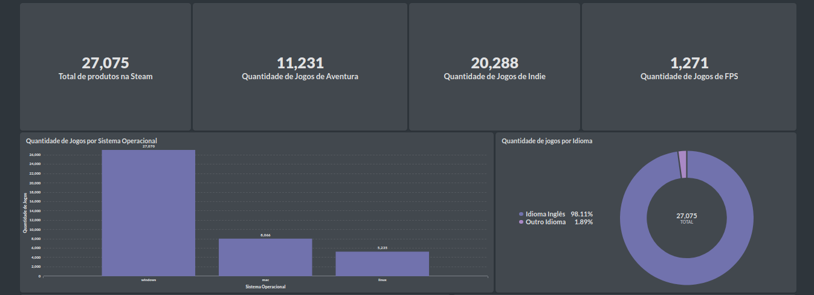

[![markdown][image-sla]][image-url]     
 
[image-sla]: img/capa_steam.gif  
[image-url]: https://store.steampowered.com/about/ 
***
# Projeto Vamos Ai
## Módulo 3

### Colaboradores do projeto 

**Thiago Silva**

**Aline Santos**

**Gabriel Borges**

**Inajá Morais**

***
## O que é a Steam ?
> É uma plataforma de loja online de jogos de computador que foi criada pela produtora Valve em 2003.
***
## Ferramentas e conceitos utilizados 
* Design thinking
* Scrum
* Kanban
* Brainstorm
* Trello
* Metabase
* Python(Biblioteca Pandas)
* Storytelling
***
## Nosso Dashboard
> Foram criadas perguntas para analisar os dados da Steam e para a visualização dos dados foi usado a ferramenta metabase, anteriormente realizamos a seleção das perguntas em SQL para depois utilizar o metabase.

### Perguntas 
1. Principais publicadoras (publishers)
2. Top 10 preços mais frequentes no steam
3. Quais categorias dos jogos mais caros;
4. Quais sistemas operacionais mais usados;
5. Top 10 gêneros maiores generos;
6. Top 10 maiores categorias de jogos (categories);
7. Idade permitida de cada jogo
8. Quantos jogos tem o idioma inglês, e quantos não tem;
9. Top 10 jogos com maior avaliação positiva (positive_ratings)
10. Top 10 jogos com maior avaliação negativa (negativa_ratings)
11. Quais jogos mais jogados (average_playtime)
12. Quais anos tem maior numero de lançamento de  jogos (release_date)
13. Principais developers;
14. Quantidade de jogos por mês de lançamento
15. Top 10 maiores categorias de jogos
16. Top 10 produtos mais caros

***
## Visualização dos dados 
***

***
### Informações sobre o trabalho ###
 **Arquivos com dados da tabela:**
* steam_description_data.sql
* steam_requirements_data.sql
* steam.sql
* steamspy_tag_data.sql

**Arquivo com as criações das tabelas e os comandos de consulta das perguntas feitas no trabalho:**
* steam_principal.sql
***